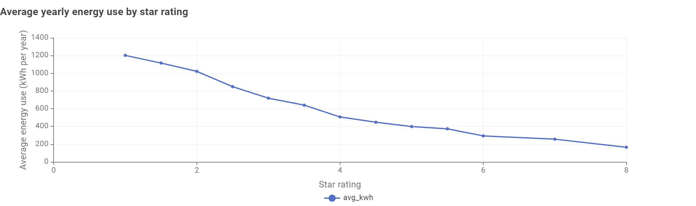

# Decision Log

## 2026-10-04 — Finding 4 changes from screen type to star rating

**Status:** Built and live. `star-vs-energy.png` and `star_rating_energy.csv` exported 4 Oct and wired into `televisions.html`, `PRODUCT.md`, `README.md`, and `about.html`. One item still open: the Bar Chart node's title/axis labels were copy-pasted from Finding 3 and need a relabel in KNIME (title still says "running cost by screen size", y-axis says "($)" when the values are kWh) — re-export over the same filename once fixed, no HTML changes needed.

### Why

Findings 3 and 4 were both built as cuts of the same `size_category` column from Exercise 2 (cost by size, screen type by size). For the independent-analysis part of the assignment, that reads as "more cuts of Exercise 2's screen size," not a new insight. Reviewed the options in chat and decided:

- **Keep Finding 3** (cost by size) — it's the independent-analysis chain the brief itself describes (`yearly_cost = energy × 0.33` → GroupBy), and the Home page headline/verdict box and calculator are already built on its numbers. Replacing it would mean rewriting the Home page too, for no real benefit this close to the deadline.
- **Replace Finding 4** (screen type by size) with a new angle: **star rating vs. actual energy use** — does the label's star rating predict real running cost? Uses the `Star2` and `Labelled energy consumption` columns, untouched by Ex 1 or Ex 2.

### Data check (done before committing to this angle)

Checked the raw `tv_2026_02_15.csv` directly, filtered to the same 4,508-row base (Available + sold in Australia):

- **Landmine:** the `Star` column is 96.7% empty (151 of 4,508 rows). **Use `Star2` instead** — fully populated, 0 nulls, half-star scale 1–8.
- **The finding holds up:** average energy use drops in an almost unbroken line from ~1,200 kWh/yr at 1 star to ~166 kWh/yr at 8 stars. Correlation −0.51.
- **Confound checked:** `Star2` vs `screensize` correlation is only −0.12 — star rating is not just screen size wearing a different hat. Safe to call it an independent signal.
- Full group-by table is in the draft below. Numbers are computed in Python against the raw CSV with the same filter KNIME uses; treat them as a preview to sanity-check your KNIME export against, not the final source of truth.

### KNIME build (owner: you)

Branch off the existing filtered 4,508-row stream (same one Finding 3 uses):

1. Column Filter → keep `Star2`, `Labelled energy consumption (kWh/year)`
2. GroupBy on `Star2` → mean energy, count (row count, for the data table)
3. Sorter on `Star2` ascending
4. Bar Chart → export `star-vs-energy.png` to `assets/img/charts/`
5. CSV Writer → `assets/data/star_rating_energy.csv`, columns `star,avg_kwh,models`, Quote values: **Never**

### Everything that needs to change once the export exists

The old Finding 4 (screen type vs. size) is referenced in more places than just the Televisions page. Checklist, in order of how visible each is:

- [ ] `televisions.html` — Finding 4 block, rail nav label, page standfirst, meta description *(full draft below — ready to paste)*
- [ ] `PRODUCT.md` — surface question (line 19), evidence bullet (line 28), finding bullet (line 71) *(draft below)*
- [ ] `README.md` — Data Story table row, FAQ question 2, story step 4, ethics small-sample example *(draft below)*
- [ ] `PROGRESS.md` — tick the new chart/CSV items, retire the old `tech-by-size.png`/`tech_by_size.csv` lines. Done 4 Oct: both files moved to `docs/archive/` (kept, but out of the Mercury upload set)
- [ ] FigJam storyboard — the Finding 4 card needs its chart sketch and takeaway updated (manual, in Figma)
- [ ] `about.html` methodology paragraph (line 56) — generic enough that it may not need a change; re-read once the real copy is in, since it currently doesn't name screen type specifically

Not touching `DESIGN.md`'s small-sample example (`"OLED: small sample"`) — that's illustrating the dashed-rule *pattern*, not a live claim, and the new table reuses the same pattern with its own small-sample rows (1 star, 8 stars).

---

## Ready-to-paste draft

Everything below is drafted against my preview numbers. **Before pasting:** swap in your real export filename/dimensions, and re-check the table against your actual KNIME output (it should match closely — same filter, same column — but confirm before publishing).

### `televisions.html`

**Meta description** (line 7), replace:
```html
<meta name="description" content="How screen size and screen type affect what a television costs to run in Australia, with a running cost calculator.">
```
with:
```html
<meta name="description" content="How screen size and star rating affect what a television costs to run in Australia, with a running cost calculator.">
```

**Standfirst** (line 43), replace:
```html
<p class="standfirst">A test of every television registered for sale in Australia. Does a bigger screen, or a premium OLED screen, cost much more to run? Four findings, then a calculator for your own TV.</p>
```
with:
```html
<p class="standfirst">A test of every television registered for sale in Australia. Does a bigger screen, or a low star rating, cost much more to run? Four findings, then a calculator for your own TV.</p>
```

**Rail nav label** (line 54), replace:
```html
<li><a href="#finding-4">Screen type matters less</a></li>
```
with:
```html
<li><a href="#finding-4">More stars means less energy</a></li>
```

**Finding 4 block** (lines 162–187), replace the whole `<section class="finding" id="finding-4" ...>...</section>` with:
```html
<section class="finding" id="finding-4" aria-labelledby="finding-4-title">
  <p class="finding-number" aria-hidden="true">4</p>
  <div class="finding-body">
    <h2 id="finding-4-title">The star rating on the label is worth trusting</h2>
    <p>Ratings aren't just a marketing sticker. Across all 4,508 models, average labelled energy use drops in an almost unbroken line as the star rating rises &mdash; from about 1,200 kWh a year at 1 star to under 200 kWh at 8 stars. The pattern barely overlaps with screen size, so a higher star rating is a genuinely separate signal, not just another way of saying "smaller screen".</p>
    <figure class="chart-figure">
      
      <figcaption>Average labelled energy consumption in kWh per year by star rating (1 to 8 stars, half-star scale). A dashed rule marks a group too small to rely on. Processed in KNIME.</figcaption>
    </figure>
    <details class="data-table">
      <summary>Show the data table</summary>
      <div class="table-scroll">
        <table>
          <caption>Average kWh per year by star rating (models tested in brackets)</caption>
          <thead><tr><th scope="col">Star rating</th><th scope="col" class="num">Avg kWh per year</th><th scope="col" class="num">Models</th></tr></thead>
          <tbody>
            <tr class="small-sample"><td>1 star <span class="sample-note">(small sample)</span></td><td class="num">1,202</td><td class="num">25</td></tr>
            <tr><td>1.5 stars</td><td class="num">1,115</td><td class="num">30</td></tr>
            <tr><td>2 stars</td><td class="num">1,021</td><td class="num">32</td></tr>
            <tr><td>2.5 stars</td><td class="num">849</td><td class="num">91</td></tr>
            <tr><td>3 stars</td><td class="num">719</td><td class="num">137</td></tr>
            <tr><td>3.5 stars</td><td class="num">640</td><td class="num">240</td></tr>
            <tr><td>4 stars</td><td class="num">507</td><td class="num">772</td></tr>
            <tr><td>4.5 stars</td><td class="num">448</td><td class="num">716</td></tr>
            <tr><td>5 stars</td><td class="num">399</td><td class="num">972</td></tr>
            <tr><td>5.5 stars</td><td class="num">373</td><td class="num">641</td></tr>
            <tr><td>6 stars</td><td class="num">294</td><td class="num">783</td></tr>
            <tr><td>7 stars</td><td class="num">256</td><td class="num">61</td></tr>
            <tr class="small-sample"><td>8 stars <span class="sample-note">(small sample)</span></td><td class="num">166</td><td class="num">8</td></tr>
          </tbody>
        </table>
      </div>
    </details>
    <p class="imperative">When comparing two TVs, check the star rating first &mdash; it is the simplest way to spot which one will cost less to run.</p>
  </div>
</section>
```

### `PRODUCT.md`

Line 19, replace:
> does a bigger screen, or an OLED screen, cost much more to run?

with:
> does a bigger screen, or a low star rating, cost much more to run?

Line 28, replace:
> a buyer leaves knowing that screen size drives running cost far more than screen type, and how to compare models;

with:
> a buyer leaves knowing that screen size and star rating both predict running cost, and how to compare models;

Line 71, replace:
> - OLED is not consistently more power hungry than LED at the same size;

with:
> - the star rating on the label tracks real energy use closely (1,202 kWh/yr at 1 star down to 166 kWh/yr at 8 stars), and is barely related to screen size;

### `README.md`

Table row (line 16), replace "...screen type)" with "...star rating)" in the Televisions row description.

FAQ question 2 (line 77), replace:
> 2. Are premium OLED screens more power hungry than LED screens?

with:
> 2. Does the star rating on the label actually predict running cost?

Story step 4 (line 81), replace:
> 4. Screen type matters much less than size (grouped bar chart)

with:
> 4. The star rating is a reliable guide to running cost (bar chart)

Ethics example (line 115), replace:
> Small groups (for example, 17 small OLED models) are flagged so averages are not over-read.

with:
> Small groups (for example, 8 models at 8 stars) are flagged so averages are not over-read.

---

**Next step:** build the KNIME branch above, export `star-vs-energy.png` and `star_rating_energy.csv`, then tell me — I'll paste in the draft, fix the image dimensions to match your actual export, and double-check the table numbers against your CSV before anything goes live.
